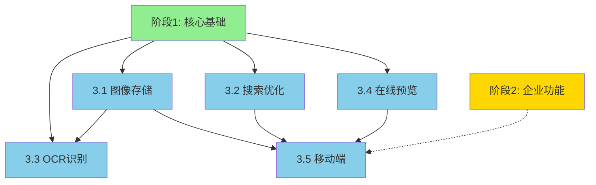

# 阶段3：用户体验增强实施计划

> **创建时间**：2026-06-22
> **状态**：草稿（等待阶段2完成）
> **预计周期**：2-3个月
> **预算范围**：21-34万元

---

## 一、目标概述

将 llm-wiki 从功能性系统提升为**卓越用户体验**的企业级知识管理平台。

### 核心目标

1. **图像资产管理** - 支持图像上传、存储、缩略图生成
2. **搜索优化** - 高亮、联想、摘要、向量搜索
3. **OCR 能力** - 扫描件文字识别（PaddleOCR）
4. **在线预览** - PDF/Office 文档在线查看
5. **移动端优化** - 响应式设计、PWA 支持

### 成功标准

- [ ] 图像上传和预览功能完整
- [ ] 搜索响应时间 < 200ms
- [ ] OCR 识别准确率 > 95%
- [ ] 文档在线预览支持 10+ 格式
- [ ] 移动端体验评分 > 90/100
- [ ] 测试覆盖率 ≥ 80%

---

## 二、实施阶段

### 阶段 3.1：图像存储与管理（4周）

#### 任务组 1：图像存储基础设施

**依赖**：阶段1（PostgreSQL + 存储抽象层）

| 任务 | 内容 | 文件 | 周期 |
|------|------|------|------|
| 1.1 | 图像表设计（images, image_variants） | `migrations/020_images.sql` | 1天 |
| 1.2 | 图像存储服务（ImageStorageService） | `lib/media/image_storage.py` | 3天 |
| 1.3 | 缩略图生成（Pillow） | `lib/media/thumbnail.py` | 2天 |
| 1.4 | 图像上传 API | `lib/api/image_api.py` | 3天 |
| 1.5 | 图像服务集成测试 | `tests/media/test_image_storage.py` | 2天 |

**技术方案**：
- PostgreSQL 存储：元数据 + 文件路径
- 文件系统：原图 + 多尺寸缩略图
- 支持：JPEG, PNG, WebP, GIF

**并行机会**：
- 任务 1.2 和 1.3 可并行（不同开发者）

#### 任务组 2：图像 Web UI

| 任务 | 内容 | 文件 | 周期 |
|------|------|------|------|
| 2.1 | 图像上传组件（拖拽 + 粘贴） | `views/components/image-upload.html` | 2天 |
| 2.2 | 图像库管理页面 | `views/media/gallery.html` | 3天 |
| 2.3 | 图像选择器（Markdown 插入） | `views/components/image-picker.html` | 2天 |

**交付物**：
- ✅ 图像上传功能（Web 端）
- ✅ 图像库管理界面
- ✅ Markdown 图像插入支持

---

### 阶段 3.2：搜索优化（2周）

#### 任务组 3：搜索引擎基础

**依赖**：阶段1（PostgreSQL + pgvector）

| 任务 | 内容 | 文件 | 周期 |
|------|------|------|------|
| 3.1 | 全文搜索索引（GIN + pg_trgm） | `migrations/030_search_indexes.sql` | 1天 |
| 3.2 | 搜索高亮（ts_headline） | `lib/search/highlight.py` | 2天 |
| 3.3 | 搜索联想（前缀匹配） | `lib/search/suggest.py` | 2天 |
| 3.4 | 摘要生成（LLM 抽取） | `lib/search/summary.py` | 3天 |
| 3.5 | 向量搜索集成 | `lib/search/vector_search.py` | 3天 |

**技术方案**：
- PostgreSQL 全文搜索（tsvector + tsquery）
- pg_trgm 支持模糊匹配
- pgvector 支持语义搜索
- 混合搜索：关键词 + 向量

#### 任务组 4：搜索 API & UI

| 任务 | 内容 | 文件 | 周期 |
|------|------|------|------|
| 4.1 | 搜索 API（统一接口） | `lib/api/search_api.py` | 2天 |
| 4.2 | 搜索前端组件 | `views/components/search-box.html` | 3天 |
| 4.3 | 搜索结果页面 | `views/search/results.html` | 2天 |

**性能目标**：
- 搜索响应时间 < 200ms
- 支持并发搜索 > 100 QPS
- 缓存命中率 > 70%

---

### 阶段 3.3：OCR 扫描件识别（3周）

#### 任务组 5：OCR 基础设施

**依赖**：阶段 3.1（图像存储）

| 任务 | 内容 | 文件 | 周期 |
|------|------|------|------|
| 5.1 | OCR 任务表设计 | `migrations/040_ocr_tasks.sql` | 1天 |
| 5.2 | PaddleOCR 集成 | `lib/ocr/paddle_ocr.py` | 5天 |
| 5.3 | OCR 任务队列（Celery/Redis） | `lib/ocr/task_queue.py` | 3天 |
| 5.4 | OCR 结果存储 | `lib/ocr/result_store.py` | 2天 |

**技术方案**：
- PaddleOCR（开源、信创友好）
- 任务队列：Celery + Redis
- 结果存储：PostgreSQL + 文件系统

**并行机会**：
- 任务 5.2 和 5.3 可并行（不同开发者）

#### 任务组 6：OCR 集成

| 任务 | 内容 | 文件 | 周期 |
|------|------|------|------|
| 6.1 | OCR 上传 API | `lib/api/ocr_api.py` | 2天 |
| 6.2 | OCR 状态查询 | `lib/api/ocr_api.py` | 1天 |
| 6.3 | OCR 结果查看 UI | `views/ocr/results.html` | 3天 |
| 6.4 | OCR 配置管理 | `views/admin/ocr-settings.html` | 2天 |

**交付物**：
- ✅ 扫描件上传和识别
- ✅ OCR 任务管理
- ✅ 识别结果查看和编辑

---

### 阶段 3.4：在线预览（4周）

#### 任务组 7：预览基础设施

**依赖**：阶段1（文件存储）

| 任务 | 内容 | 文件 | 周期 |
|------|------|------|------|
| 7.1 | 预览表设计（previews） | `migrations/050_previews.sql` | 1天 |
| 7.2 | PDF.js 集成（PDF 预览） | `lib/preview/pdf_viewer.py` | 4天 |
| 7.3 | KKFileView 集成（Office） | `lib/preview/office_viewer.py` | 5天 |
| 7.4 | 预览缓存管理 | `lib/preview/cache_manager.py` | 3天 |

**技术方案**：
- PDF.js：浏览器端 PDF 渲染
- KKFileView：Office 文档转换（信创友好）
- 缓存：Redis + 文件系统

**并行机会**：
- 任务 7.2 和 7.3 可并行（不同开发者）

#### 任务组 8：预览 UI

| 任务 | 内容 | 文件 | 周期 |
|------|------|------|------|
| 8.1 | 预览 API | `lib/api/preview_api.py` | 3天 |
| 8.2 | PDF 预览组件 | `views/components/pdf-viewer.html` | 3天 |
| 8.3 | Office 预览组件 | `views/components/office-viewer.html` | 3天 |
| 8.4 | 预览管理页面 | `views/admin/preview-settings.html` | 2天 |

**支持格式**：
- PDF（PDF.js）
- Word/Excel/PPT（KKFileView）
- 图片（浏览器原生）
- Markdown（内置渲染）

---

### 阶段 3.5：移动端优化（3周）

#### 任务组 9：响应式设计

**依赖**：阶段 3.1-3.4（所有 Web UI）

| 任务 | 内容 | 文件 | 周期 |
|------|------|------|------|
| 9.1 | 响应式布局框架 | `views/layouts/responsive.html` | 3天 |
| 9.2 | 移动端导航 | `views/components/mobile-nav.html` | 2天 |
| 9.3 | 移动端编辑器 | `views/components/mobile-editor.html` | 5天 |
| 9.4 | 触摸手势支持 | `static/js/touch-gestures.js` | 3天 |

#### 任务组 10：PWA 支持

| 任务 | 内容 | 文件 | 周期 |
|------|------|------|------|
| 10.1 | Service Worker | `static/sw.js` | 3天 |
| 10.2 | 离线缓存策略 | `static/js/offline-cache.js` | 3天 |
| 10.3 | 安装提示 | `views/components/pwa-install.html` | 1天 |
| 10.4 | Push 通知 | `lib/push/notification.py` | 4天 |

**技术方案**：
- 响应式：Tailwind CSS + CSS Grid
- PWA：Service Worker + Cache API
- 离线：IndexedDB + LocalStorage

---

## 三、依赖关系图



### 关键依赖

| 阶段 | 依赖 | 原因 |
|------|------|------|
| 3.1 图像存储 | 阶段1（存储抽象层） | 使用统一存储接口 |
| 3.2 搜索优化 | 阶段1（PostgreSQL + pgvector） | 数据库全文搜索 |
| 3.3 OCR | 阶段1 + 3.1 | 图像存储作为输入 |
| 3.4 在线预览 | 阶段1（文件存储） | 文件访问能力 |
| 3.5 移动端 | 3.1-3.4 | 所有 UI 组件 |
| 全部 | 阶段2（可选） | 权限控制 |

### 并行执行策略

**可并行**：
- ✅ 3.1（图像）和 3.2（搜索）- 无依赖
- ✅ 3.3（OCR）和 3.4（预览）- 无依赖（等3.1完成）
- ✅ 3.1 内部任务 1.2 和 1.3
- ✅ 3.3 内部任务 5.2 和 5.3
- ✅ 3.4 内部任务 7.2 和 7.3

**必须串行**：
- ❌ 3.5（移动端）必须等 3.1-3.4 完成

---

## 四、技术方案

### 4.1 图像存储架构

```
┌─────────────┐
│  Web Client │
└──────┬──────┘
       │ 上传图像
       ▼
┌─────────────────────────┐
│  ImageStorageService    │
│  ├─ 元数据提取          │
│  ├─ 格式验证            │
│  └─ 缩略图生成          │
└──────┬──────────────────┘
       │
       ▼
┌─────────────────────────┐
│  PostgreSQL (元数据)    │
│  images 表              │
│  image_variants 表      │
└─────────────────────────┘
       │
       ▼
┌─────────────────────────┐
│  文件系统 (二进制)      │
│  /uploads/images/       │
│  /uploads/thumbnails/   │
└─────────────────────────┘
```

### 4.2 搜索架构

```
┌─────────────┐
│  搜索请求   │
└──────┬──────┘
       │
       ▼
┌─────────────────────────┐
│  SearchAPI              │
│  ├─ 关键词搜索          │
│  ├─ 向量搜索            │
│  └─ 混合搜索            │
└──────┬──────────────────┘
       │
       ├─────────────────┐
       ▼                 ▼
┌─────────────┐   ┌─────────────┐
│ PostgreSQL  │   │  pgvector   │
│  (全文搜索) │   │ (语义搜索)  │
└──────┬──────┘   └──────┬──────┘
       │                 │
       └────────┬────────┘
                ▼
       ┌─────────────────┐
       │  结果合并 & 排序│
       └────────┬────────┘
                │
                ▼
       ┌─────────────────┐
       │  高亮 & 摘要    │
       └─────────────────┘
```

### 4.3 OCR 工作流

```
┌─────────────┐
│  上传扫描件 │
└──────┬──────┘
       │
       ▼
┌─────────────────────────┐
│  OCRApi                 │
│  ├─ 创建任务            │
│  └─ 加入队列            │
└──────┬──────────────────┘
       │
       ▼
┌─────────────────────────┐
│  Celery Task Queue      │
│  ├─ 任务调度            │
│  └─ 失败重试            │
└──────┬──────────────────┘
       │
       ▼
┌─────────────────────────┐
│  PaddleOCR Worker       │
│  ├─ 图像预处理          │
│  ├─ 文字识别            │
│  └─ 结果后处理          │
└──────┬──────────────────┘
       │
       ▼
┌─────────────────────────┐
│  结果存储               │
│  ├─ PostgreSQL (文本)   │
│  └─ 文件系统 (JSON)    │
└─────────────────────────┘
```

---

## 五、风险评估

### 高风险（HIGH）

| 风险 | 影响 | 缓解措施 |
|------|------|---------|
| KKFileView 部署复杂 | Office 预览延期 | 提前搭建测试环境 |
| PaddleOCR 性能瓶颈 | OCR 响应慢 | GPU 加速 + 任务队列 |
| 移动端兼容性问题 | 部分设备异常 | 主流设备测试覆盖 |

### 中风险（MEDIUM）

| 风险 | 影响 | 缓解措施 |
|------|------|---------|
| 搜索性能不达标 | 用户体验差 | 索引优化 + 缓存 |
| 图像存储空间不足 | 成本增加 | 压缩 + CDN |
| PWA 兼容性 | 离线功能受限 | 降级方案 |

### 低风险（LOW）

| 风险 | 影响 | 缓解措施 |
|------|------|---------|
| 缩略图质量不佳 | 预览效果差 | 多尺寸生成 |
| OCR 准确率波动 | 识别错误 | 后处理校对 |

---

## 六、预算估算

| 阶段 | 人力成本 | 基础设施 | 合计 |
|------|----------|----------|------|
| 3.1 图像存储 | 5-8万 | 1-2万 | 6-10万 |
| 3.2 搜索优化 | 3-5万 | 0.5万 | 3.5-5.5万 |
| 3.3 OCR | 4-7万 | 1万 | 5-8万 |
| 3.4 在线预览 | 4-6万 | 1万 | 5-7万 |
| 3.5 移动端 | 3-5万 | 0.5万 | 3.5-5.5万 |
| **总计** | **19-31万** | **4万** | **23-35万** |

**说明**：
- 人力成本：按 1-2 名开发者计算
- 基础设施：Redis, GPU 服务器（OCR）, 存储扩容

---

## 七、里程碑计划

| 里程碑 | 目标 | 预计时间 | 依赖 |
|--------|------|----------|------|
| M1 | 图像存储完成 | 第 4 周末 | 阶段1 |
| M2 | 搜索优化完成 | 第 6 周末 | 阶段1 |
| M3 | OCR 完成 | 第 9 周末 | M1 |
| M4 | 在线预览完成 | 第 10 周末 | 阶段1 |
| M5 | 移动端完成 | 第 13 周末 | M1-M4 |

---

## 八、验收标准

### 功能验收

- [ ] 图像上传成功，支持 5 种格式
- [ ] 缩略图自动生成（3 种尺寸）
- [ ] 搜索响应时间 < 200ms
- [ ] 搜索高亮和联想正常
- [ ] OCR 识别准确率 > 95%
- [ ] PDF/Office 文档在线预览正常
- [ ] 移动端响应式布局正常
- [ ] PWA 离线功能可用

### 性能验收

- [ ] 图像上传时间 < 5s（10MB 内）
- [ ] 搜索延迟 < 200ms（95 分位）
- [ ] OCR 处理时间 < 30s（单页）
- [ ] 文档预览加载时间 < 3s
- [ ] 移动端首屏加载时间 < 2s

### 质量验收

- [ ] 测试覆盖率 ≥ 80%
- [ ] 所有测试通过
- [ ] 无严重 Bug
- [ ] API 文档完整
- [ ] 部署文档完整

---

## 九、下一步行动

### 立即执行（阶段2完成后）

1. **环境准备**
   ```bash
   # 安装依赖
   pip install Pillow paddleocr pdf2image

   # 启动 Redis（OCR 队列）
   docker run -d redis:latest

   # 部署 KKFileView
   docker run -d keking/kkfileview
   ```

2. **启动阶段 3.1**
   - 调用 `/plan-segment PLAN-003-phase3-ux-enhancement.md --phase=3.1`
   - 创建图像存储任务组

3. **并行执行**
   - 团队A：阶段 3.1（图像存储）
   - 团队B：阶段 3.2（搜索优化）

### 等待确认

- [ ] 阶段2完成确认
- [ ] 预算审批（21-34万元）
- [ ] 人力安排（1-2 名开发者）
- [ ] 基础设施准备（Redis, GPU）

---

## 十、参考资料

- [[enterprise-overall-plan]] - 总体计划
- [[PLAN-002-execution-report-2026-06-22]] - 阶段1执行报告
- [PaddleOCR 文档](https://github.com/PaddlePaddle/PaddleOCR)
- [KKFileView 文档](https://github.com/kekingcn/kkFileView)
- [PDF.js 文档](https://mozilla.github.io/pdf.js/)

---

**计划创建时间**：2026-06-22
**最后更新时间**：2026-06-22
**状态**：草稿（等待阶段2完成）
