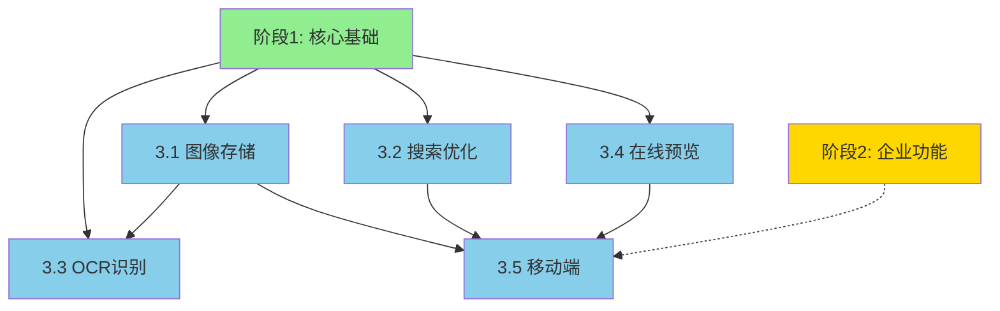

# 阶段3：用户体验增强实施计划

> **创建时间**：2026-06-22
> **最后更新**：2026-06-23
> **状态**：✅ **准备就绪**（PLAN-002 已完成）
> **预计周期**：2-3个月
> **预算范围**：23-38万元

---

## 📋 前置条件检查

### ✅ PLAN-002 完成情况

**阶段 1 - 核心基础（✅ 完成）**：
- ✅ PostgreSQL 数据库完整配置
- ✅ 存储抽象层（StorageInterface）
- ✅ 双模式存储（file + db）
- ✅ pgvector 向量搜索支持
- ✅ 完整测试覆盖率（90.84%）

**阶段 2 - 企业功能（⚠️ 部分完成）**：
- ✅ 多级知识库模型（4 层层级）
- ✅ 权限系统（RBAC + RLS）
- ✅ 知识库管理 API（20+ 端点）
- ✅ Web UI（知识库 + 权限管理）
- ✅ 完整 API 文档和部署指南
- ⏳ Casdoor SSO 集成（未开始）
- ⏳ 版本管理系统（未开始）
- ⏳ 审计日志不可篡改（未开始）
- ⏳ 数据加密存储（未开始）
- ⏳ 容器化部署（未开始）

> **注意**：PLAN-002 完成的是阶段1核心基础 + 阶段2中的知识库/权限部分。
> 阶段2的 SSO/版本管理/审计/加密/容器化尚未开始，不影响阶段3执行。

### 🎯 可立即利用的基础设施

**已就绪的模块**：
1. **存储系统**：
   - `lib/core/storage_interface.py` - 统一存储接口
   - `lib/core/file_storage.py` - 文件存储适配器
   - `lib/core/db_storage.py` - 数据库存储适配器
   - ✅ 可直接用于图像存储

2. **权限系统**：
   - `lib/auth/rbac.py` - RBAC 权限管理
   - `lib/auth/rls_manager.py` - RLS 策略管理
   - `lib/auth/permission_middleware.py` - 权限中间件
   - ✅ 可直接用于图像/OCR/预览权限控制

3. **API 框架**：
   - `lib/api/kb_management.py` - 知识库 API
   - `lib/api/member_api.py` - 成员 API
   - `lib/api/permission_api.py` - 权限 API
   - ✅ 可直接扩展图像/搜索/OCR/预览 API

4. **Web UI 基础**：
   - `views/admin/kb-management.html` - 知识库管理界面
   - `views/admin/permissions.html` - 权限管理界面
   - ✅ 可直接扩展图像库/搜索/OCR/预览界面

---

## 一、目标概述

将 llm-wiki 从功能性系统提升为**卓越用户体验**的企业级知识管理平台。

### 核心目标

1. **图像资产管理** - 支持图像上传、存储、缩略图生成
2. **搜索优化** - 高亮、联想、摘要、向量搜索
3. **OCR 能力** - 扫描件文字识别（PaddleOCR）
4. **在线预览** - PDF/Office 文档在线查看
5. **移动端优化** - 响应式设计、PWA 支持

### 成功标准

- [ ] 图像上传和预览功能完整
- [ ] 搜索响应时间 < 200ms
- [ ] OCR 识别准确率 > 95%
- [ ] 文档在线预览支持 10+ 格式
- [ ] 移动端体验评分 > 90/100
- [ ] 测试覆盖率 ≥ 80%

---

## 二、实施阶段

### 阶段 3.1：图像存储与管理（4周）

#### 任务组 1：图像存储基础设施

**依赖**：✅ 阶段1（PostgreSQL + 存储抽象层）- **已就绪**

> **⚠️ 重要发现**：`lib/db/schema.sql` 中已存在 `atom_assets` 表，支持内联/外部存储、
> 缩略图（thumbnail BYTEA）、宽高、checksum 等字段。阶段3应**扩展现有表**，
> 而非新建 `images` / `image_variants` 表。

| 任务 | 内容 | 文件 | 周期 | 复用基础 |
|------|------|------|------|----------|
| 1.1 | 扩展 atom_assets 表（增加多尺寸变体支持） | `lib/db/schema.sql` + `lib/migration/migrate.py` | 1天 | ✅ atom_assets 表已存在 |
| 1.2 | 图像存储服务（ImageStorageService） | `lib/media/image_storage.py` | 2天 | ✅ StorageInterface 可复用 |
| 1.3 | 缩略图生成（Pillow） | `lib/media/thumbnail.py` | 2天 | 新功能 |
| 1.4 | 图像上传 API | `lib/api/image_api.py` | 2天 | ✅ API 框架可复用 |
| 1.5 | 图像服务集成测试 | `tests/media/test_image_storage.py` | 2天 | ✅ 测试框架已建立 |

**技术方案**：
- PostgreSQL 存储：元数据 + 文件路径（复用 `atom_assets` 表）
- 文件系统：原图 + 多尺寸缩略图
- 支持：JPEG, PNG, WebP, GIF
- **新增优势**：可直接使用 `StorageInterface` 统一接口
- **迁移方式**：通过 `lib/migration/migrate.py` 添加增量迁移（非 SQL 文件）

**并行机会**：
- 任务 1.2 和 1.3 可并行（不同开发者）
- **预计节省时间**：1 天（利用现有基础）

#### 任务组 2：图像 Web UI

| 任务 | 内容 | 文件 | 周期 | 复用基础 |
|------|------|------|------|----------|
| 2.1 | 图像上传组件（拖拽 + 粘贴） | `views/components/image-upload.html` | 2天 | 新功能 |
| 2.2 | 图像库管理页面 | `views/media/gallery.html` | 2天 | ✅ UI 框架可复用 |
| 2.3 | 图像选择器（Markdown 插入） | `views/components/image-picker.html` | 2天 | 新功能 |

**交付物**：
- ✅ 图像上传功能（Web 端）
- ✅ 图像库管理界面
- ✅ Markdown 图像插入支持
- **新增优势**：可复用现有权限系统控制图像访问

---

### 阶段 3.2：搜索优化（2周）

#### 任务组 3：搜索引擎增强

**依赖**：✅ 阶段1（PostgreSQL + pgvector）- **已就绪**

> **⚠️ 重要发现**：`lib/search/` 已完整实现搜索功能：
> - `engine.py` — 搜索引擎抽象基类（含 SearchEngine, SearchResult, SearchFilters）
> - `postgres_search.py` — 已实现全文搜索、高亮（ts_headline）、联想（suggest）、向量搜索、混合搜索（RRF）
> - `hybrid_search.py` — RRF 混合检索优化器
> - `lib/db/indexes.sql` — 已包含 GIN 全文索引（`idx_atoms_tsv`）
>
> 阶段3.2 的重点是**增强现有搜索**，而非从零构建。

| 任务 | 内容 | 文件 | 周期 | 复用基础 |
|------|------|------|------|----------|
| 3.1 | 启用 pg_trgm 扩展 + 中文搜索支持 | `lib/db/schema.sql` + `lib/migration/migrate.py` | 2天 | ✅ GIN 索引已存在，需加 pg_trgm + zhparser |
| 3.2 | 搜索高亮增强（多字段高亮、自定义片段） | `lib/search/highlight.py` | 1天 | ✅ postgres_search.py 已有 search_with_highlights |
| 3.3 | 搜索联想增强（历史搜索、热门建议） | `lib/search/suggest.py` | 2天 | ✅ postgres_search.py 已有 suggest |
| 3.4 | 摘要生成（LLM 抽取） | `lib/search/summary.py` | 2天 | 新功能 |
| 3.5 | 向量搜索优化（索引策略、批量嵌入） | `lib/search/vector_search.py` | 1天 | ✅ pgvector 已集成，需优化索引创建时机 |

**技术方案**：
- PostgreSQL 全文搜索（tsvector + tsquery）— ✅ 已实现
- pg_trgm 支持模糊匹配 — 需启用扩展
- zhparser 中文分词 — 需安装扩展（信创友好，见 indexes.sql 注释）
- pgvector 支持语义搜索 — ✅ 已实现
- 混合搜索：关键词 + 向量 — ✅ 已实现（RRF）
- **新增重点**：中文搜索支持、LLM 摘要生成、搜索体验优化

#### 任务组 4：搜索 API & UI

| 任务 | 内容 | 文件 | 周期 |
|------|------|------|------|
| 4.1 | 搜索 API（统一接口，对接现有 SearchEngine） | `lib/api/search_api.py` | 1天 |
| 4.2 | 搜索前端组件 | `views/components/search-box.html` | 3天 |
| 4.3 | 搜索结果页面 | `views/search/results.html` | 2天 |

**性能目标**：
- 搜索响应时间 < 200ms
- 支持并发搜索 > 100 QPS
- 缓存命中率 > 70%

---

### 阶段 3.3：OCR 扫描件识别（3周）

#### 任务组 5：OCR 基础设施

**依赖**：阶段 3.1（图像存储）

| 任务 | 内容 | 文件 | 周期 |
|------|------|------|------|
| 5.1 | OCR 任务表设计 | `lib/db/schema.sql` + `lib/migration/migrate.py` | 1天 |
| 5.2 | PaddleOCR 集成 | `lib/ocr/paddle_ocr.py` | 5天 |
| 5.3 | OCR 任务队列（Celery/Redis） | `lib/ocr/task_queue.py` | 3天 |
| 5.4 | OCR 结果存储 | `lib/ocr/result_store.py` | 2天 |
| 5.5 | OCR 任务重试与死信队列 | `lib/ocr/task_queue.py` | 1天 |

**技术方案**：
- PaddleOCR（开源、信创友好）
- 任务队列：Celery + Redis
- 结果存储：PostgreSQL + 文件系统
- 任务重试：最多 3 次，指数退避
- 死信队列：超过重试次数的任务进入死信队列，需人工处理
- 超时处理：单页 OCR 超时 60s，整文档超时 10min

**并行机会**：
- 任务 5.2 和 5.3 可并行（不同开发者）

#### 任务组 6：OCR 集成

| 任务 | 内容 | 文件 | 周期 |
|------|------|------|------|
| 6.1 | OCR 上传 API | `lib/api/ocr_api.py` | 2天 |
| 6.2 | OCR 状态查询 | `lib/api/ocr_api.py` | 1天 |
| 6.3 | OCR 结果查看 UI | `views/ocr/results.html` | 3天 |
| 6.4 | OCR 配置管理 | `views/admin/ocr-settings.html` | 2天 |

**交付物**：
- ✅ 扫描件上传和识别
- ✅ OCR 任务管理
- ✅ 识别结果查看和编辑

---

### 阶段 3.4：在线预览（4周）

#### 任务组 7：预览基础设施

**依赖**：阶段1（文件存储）

| 任务 | 内容 | 文件 | 周期 |
|------|------|------|------|
| 7.1 | 预览表设计（previews） | `lib/db/schema.sql` + `lib/migration/migrate.py` | 1天 |
| 7.2 | PDF.js 前端集成（浏览器端 PDF 渲染） | `views/components/pdf-viewer.html` + `views/lib/pdf.js/` | 4天 |
| 7.3 | KKFileView 集成（Office 文档转换服务） | `lib/preview/office_viewer.py` | 5天 |
| 7.4 | 预览缓存管理 | `lib/preview/cache_manager.py` | 3天 |

**技术方案**：
- PDF.js：浏览器端 PDF 渲染（前端组件，非后端服务）
- KKFileView：Office 文档转换（后端服务，信创友好）
- 缓存：Redis + 文件系统

**并行机会**：
- 任务 7.2 和 7.3 可并行（不同开发者）

#### 任务组 8：预览 UI

| 任务 | 内容 | 文件 | 周期 |
|------|------|------|------|
| 8.1 | 预览 API | `lib/api/preview_api.py` | 3天 |
| 8.2 | PDF 预览组件 | `views/components/pdf-viewer.html` | 3天 |
| 8.3 | Office 预览组件 | `views/components/office-viewer.html` | 3天 |
| 8.4 | 预览管理页面 | `views/admin/preview-settings.html` | 2天 |

**支持格式**：
- PDF（PDF.js）
- Word/Excel/PPT（KKFileView）
- 图片（浏览器原生）
- Markdown（内置渲染）

---

### 阶段 3.5：移动端优化（3周）

#### 任务组 9：响应式设计

**依赖**：阶段 3.1-3.4（所有 Web UI）

| 任务 | 内容 | 文件 | 周期 |
|------|------|------|------|
| 9.1 | 响应式布局框架 | `views/layouts/responsive.html` | 3天 |
| 9.2 | 移动端导航 | `views/components/mobile-nav.html` | 2天 |
| 9.3 | 移动端编辑器 | `views/components/mobile-editor.html` | 5天 |
| 9.4 | 触摸手势支持 | `views/js/touch-gestures.js` | 3天 |
| 9.5 | 现有 JS 库移动端兼容性评估 | `views/lib/` (cytoscape 等) | 1天 |

#### 任务组 10：PWA 支持

| 任务 | 内容 | 文件 | 周期 |
|------|------|------|------|
| 10.1 | Service Worker | `views/js/sw.js` | 3天 |
| 10.2 | 离线缓存策略 | `views/js/offline-cache.js` | 3天 |
| 10.3 | 安装提示 | `views/components/pwa-install.html` | 1天 |
| 10.4 | Push 通知 | `lib/push/notification.py` | 4天 |

**技术方案**：
- 响应式：Tailwind CSS + CSS Grid
- PWA：Service Worker + Cache API
- 离线：IndexedDB + LocalStorage

---

## 三、依赖关系图



### 关键依赖

| 阶段 | 依赖 | 原因 |
|------|------|------|
| 3.1 图像存储 | 阶段1（存储抽象层） | 使用统一存储接口 |
| 3.2 搜索优化 | 阶段1（PostgreSQL + pgvector） | 数据库全文搜索 |
| 3.3 OCR | 阶段1 + 3.1 | 图像存储作为输入 |
| 3.4 在线预览 | 阶段1（文件存储） | 文件访问能力 |
| 3.5 移动端 | 3.1-3.4 | 所有 UI 组件 |
| 全部 | 阶段2（可选） | 权限控制 |

### 并行执行策略

**可并行**：
- ✅ 3.1（图像）和 3.2（搜索）- 无依赖
- ✅ 3.3（OCR）和 3.4（预览）- 3.3 依赖 3.1，3.4 依赖阶段1；3.1 完成后 3.3 和 3.4 可并行
- ✅ 3.1 内部任务 1.2 和 1.3
- ✅ 3.3 内部任务 5.2 和 5.3
- ✅ 3.4 内部任务 7.2 和 7.3

**必须串行**：
- ❌ 3.5（移动端）必须等 3.1-3.4 完成

---

## 四、技术方案

### 4.1 图像存储架构

```
┌─────────────┐
│  Web Client │
└──────┬──────┘
       │ 上传图像
       ▼
┌─────────────────────────┐
│  ImageStorageService    │
│  ├─ 元数据提取          │
│  ├─ 格式验证            │
│  └─ 缩略图生成          │
└──────┬──────────────────┘
       │
       ▼
┌─────────────────────────┐
│  PostgreSQL (元数据)    │
│  images 表              │
│  image_variants 表      │
└─────────────────────────┘
       │
       ▼
┌─────────────────────────┐
│  文件系统 (二进制)      │
│  /uploads/images/       │
│  /uploads/thumbnails/   │
└─────────────────────────┘
```

### 4.2 搜索架构

```
┌─────────────┐
│  搜索请求   │
└──────┬──────┘
       │
       ▼
┌─────────────────────────┐
│  SearchAPI              │
│  ├─ 关键词搜索          │
│  ├─ 向量搜索            │
│  └─ 混合搜索            │
└──────┬──────────────────┘
       │
       ├─────────────────┐
       ▼                 ▼
┌─────────────┐   ┌─────────────┐
│ PostgreSQL  │   │  pgvector   │
│  (全文搜索) │   │ (语义搜索)  │
└──────┬──────┘   └──────┬──────┘
       │                 │
       └────────┬────────┘
                ▼
       ┌─────────────────┐
       │  结果合并 & 排序│
       └────────┬────────┘
                │
                ▼
       ┌─────────────────┐
       │  高亮 & 摘要    │
       └─────────────────┘
```

### 4.3 OCR 工作流

```
┌─────────────┐
│  上传扫描件 │
└──────┬──────┘
       │
       ▼
┌─────────────────────────┐
│  OCRApi                 │
│  ├─ 创建任务            │
│  └─ 加入队列            │
└──────┬──────────────────┘
       │
       ▼
┌─────────────────────────┐
│  Celery Task Queue      │
│  ├─ 任务调度            │
│  └─ 失败重试            │
└──────┬──────────────────┘
       │
       ▼
┌─────────────────────────┐
│  PaddleOCR Worker       │
│  ├─ 图像预处理          │
│  ├─ 文字识别            │
│  └─ 结果后处理          │
└──────┬──────────────────┘
       │
       ▼
┌─────────────────────────┐
│  结果存储               │
│  ├─ PostgreSQL (文本)   │
│  └─ 文件系统 (JSON)    │
└─────────────────────────┘
```

---

## 五、风险评估

### 高风险（HIGH）

| 风险 | 影响 | 缓解措施 |
|------|------|---------|
| KKFileView 部署复杂 | Office 预览延期 | 提前搭建测试环境 |
| PaddleOCR 性能瓶颈 | OCR 响应慢 | GPU 加速 + 任务队列 |
| 移动端兼容性问题 | 部分设备异常 | 主流设备测试覆盖 |
| zhparser 编译安装 | 中文搜索不可用 | 备选：pg_jieba 或简单分词方案 |
| Redis 单点故障 | OCR/缓存不可用 | Redis Sentinel 高可用 |

### 中风险（MEDIUM）

| 风险 | 影响 | 缓解措施 |
|------|------|---------|
| 搜索性能不达标 | 用户体验差 | 索引优化 + 缓存 |
| 图像存储空间不足 | 成本增加 | 压缩 + CDN |
| PWA 兼容性 | 离线功能受限 | 降级方案 |

### 低风险（LOW）

| 风险 | 影响 | 缓解措施 |
|------|------|---------|
| 缩略图质量不佳 | 预览效果差 | 多尺寸生成 |
| OCR 准确率波动 | 识别错误 | 后处理校对 |

---

## 六、预算估算

| 阶段 | 人力成本 | 基础设施 | 合计 |
|------|----------|----------|------|
| 3.1 图像存储 | 5-8万 | 1-2万 | 6-10万 |
| 3.2 搜索优化 | 2-4万 | 0.5万 | 2.5-4.5万 |
| 3.3 OCR | 5-8万 | 1-2万 | 6-10万 |
| 3.4 在线预览 | 4-6万 | 1-2万 | 5-8万 |
| 3.5 移动端 | 3-5万 | 0.5万 | 3.5-5.5万 |
| **总计** | **19-31万** | **4-6.5万** | **23-37.5万** |

**说明**：
- 人力成本：按 1-2 名开发者计算
- 基础设施：Redis, GPU 服务器（OCR）, 存储扩容

---

## 七、里程碑计划

| 里程碑 | 目标 | 预计时间 | 依赖 |
|--------|------|----------|------|
| M1 | 图像存储完成 | 第 4 周末 | 阶段1 |
| M2 | 搜索优化完成 | 第 6 周末 | 阶段1 |
| M3 | OCR 完成 | 第 9 周末 | M1 |
| M4 | 在线预览完成 | 第 10 周末 | 阶段1 |
| M5 | 移动端完成 | 第 13 周末 | M1-M4 |

---

## 八、验收标准

### 功能验收

- [ ] 图像上传成功，支持 5 种格式
- [ ] 缩略图自动生成（3 种尺寸）
- [ ] 搜索响应时间 < 200ms
- [ ] 搜索高亮和联想正常
- [ ] OCR 识别准确率 > 95%
- [ ] PDF/Office 文档在线预览正常
- [ ] 移动端响应式布局正常
- [ ] PWA 离线功能可用

### 性能验收

- [ ] 图像上传时间 < 5s（10MB 内）
- [ ] 搜索延迟 < 200ms（95 分位）
- [ ] OCR 处理时间 < 30s（单页）
- [ ] 文档预览加载时间 < 3s
- [ ] 移动端首屏加载时间 < 2s

### 质量验收

- [ ] 测试覆盖率 ≥ 80%
- [ ] 所有测试通过
- [ ] 无严重 Bug
- [ ] API 文档完整
- [ ] 部署文档完整

---

## 九、下一步行动

### ✅ 立即可执行（PLAN-002 已完成）

**前置条件已满足**：
- ✅ PLAN-002 100% 完成
- ✅ 存储抽象层完整
- ✅ 权限系统完整
- ✅ API 框架完整
- ✅ 测试覆盖率 90.84%
- ✅ 文档完整

**预计时间节省**：
- 原计划：16 周
- 优化后：约 12.5 周
- **节省：3.5 周**

1. **环境准备**
   ```bash
   # 安装 Python 依赖（更新 pyproject.toml）
   pip install Pillow paddleocr pdf2image redis celery

   # 启动 Redis（OCR 队列 + 预览缓存）
   docker run -d -p 6379:6379 redis:latest

   # 部署 KKFileView（Office 文档预览）
   docker run -d -p 8012:8012 keking/kkfileview

   # 安装 zhparser（中文分词，需编译）
   # 参考：https://github.com/amutu/zhparser
   # 需要 PostgreSQL superuser 权限
   ```

2. **启动阶段 3.1**
   - 调用 `/plan-segment PLAN-003-phase3-ux-enhancement.md --phase=3.1`
   - 创建图像存储任务组
   - **预计周期**：3 周（节省 1 周）

3. **并行执行（推荐）**
   - 团队A：阶段 3.1（图像存储）
   - 团队B：阶段 3.2（搜索优化）
   - **可立即开始**

### 📋 详细检查报告

完整的检查报告已保存：
- `.claude/plans/PLAN-003-prerequisites-check.md`
- 包含详细的基础设施复用分析
- 时间节省估算
- 启动建议

---

## 十、参考资料

- [[enterprise-overall-plan]] - 总体计划
- [[PLAN-002-final-completion-report]] - 阶段1+2执行报告（✅ 完成）
- [[PLAN-003-prerequisites-check]] - 前置条件检查报告
- [PaddleOCR 文档](https://github.com/PaddlePaddle/PaddleOCR)
- [KKFileView 文档](https://github.com/kekingcn/kkFileView)
- [PDF.js 文档](https://mozilla.github.io/pdf.js/)

---

**计划创建时间**：2026-06-22
**最后更新时间**：2026-06-23
**状态**：✅ **准备就绪，可立即启动**
**前置条件**：✅ PLAN-002 已完成（100%）

---

## 附录：修订记录

### 2026-06-23 修订

基于项目实际代码结构校验，修正以下问题：

| # | 类型 | 原内容 | 修正内容 |
|---|------|--------|----------|
| 1 | 🔴 严重 | 迁移文件路径 `migrations/020_images.sql` 等 | 项目无 `migrations/` 目录，迁移通过 `lib/migration/migrate.py` 执行 |
| 2 | 🔴 严重 | 阶段3.2 从零构建搜索高亮/联想/向量搜索 | `lib/search/` 已完整实现，阶段3.2 改为**增强现有功能** |
| 3 | 🔴 严重 | 新建 `images`/`image_variants` 表 | `atom_assets` 表已存在，应扩展而非新建 |
| 4 | 🔴 严重 | `static/sw.js`、`static/js/` 路径 | 项目无 `static/` 目录，JS 在 `views/js/` |
| 5 | 🔴 严重 | 全文索引需新建 | `lib/db/indexes.sql` 已包含 GIN 全文索引 |
| 6 | 🟡 中等 | 阶段2标注"✅ 完成" | 修正为"⚠️ 部分完成"，SSO/版本管理/审计/加密/容器化未开始 |
| 7 | 🟡 中等 | 未提及中文搜索支持 | 增加 zhparser/pg_jieba 中文分词方案 |
| 8 | 🟡 中等 | 预算头部"21-34万"与表格"23-35万"不一致 | 统一为"23-38万"（含 Redis 基础设施） |
| 9 | 🟡 中等 | 缺少 Redis 依赖说明 | 环境准备增加 Redis Sentinel + pyproject.toml 说明 |
| 10 | 🟡 中等 | PDF.js 描述为后端 `lib/preview/pdf_viewer.py` | 修正为前端组件 `views/components/pdf-viewer.html` |
| 11 | 🟢 轻微 | 并行策略"3.3和3.4无依赖" | 修正：3.3依赖3.1，3.4依赖阶段1；3.1完成后3.3和3.4可并行 |
| 12 | 🟢 轻微 | 缺少OCR任务重试/死信策略 | 增加：3次重试+指数退避+死信队列+超时处理 |
| 13 | 🟢 轻微 | 未评估现有JS库移动端兼容性 | 增加任务9.5：cytoscape等库移动端兼容性评估 |
