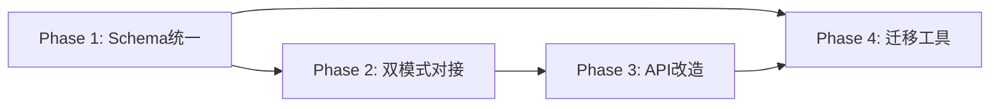

# PLAN-004：PostgreSQL 生产集成

> **创建时间**：2026-06-23
> **状态**：草稿
> **预计周期**：2-3 周
> **优先级**：P0（阻塞所有下游功能）

---

## 一、需求重述

将已编写完成的 PostgreSQL 相关代码（Schema、管理器、搜索、OCR、预览）真正接入生产环境，使 llm-wiki 支持双模式运行：

- **file_mode**：保留现有 Skill 模式（Markdown + Obsidian 兼容）
- **db_mode**：PostgreSQL 存储，支持 RLS、全文搜索、OCR、在线预览

核心问题：代码已写好但"零件没装上"，需要做的是**组装和对接**。

---

## 二、当前状态

| 模块 | 状态 | 关键缺失 |
|------|:----:|----------|
| Schema（schema.sql） | ✅ | 管理器内联 schema 与 schema.sql 不同步 |
| PostgreSQLManager | 🔄 | 内联 schema 简化版；缺 `execute/fetch_one/fetch_all` 通用方法；无 RLS 集成 |
| 双模式架构 | 🔄 | `DatabaseStorage` 与 `PostgreSQLManager` 接口不匹配 |
| 主程序接入 | ⏳ | web_server 35+ 端点全基于文件 I/O，无 PostgreSQL 引用 |
| 配置管理 | ✅ | 缺 SSL/超时配置 |
| 迁移工具 | 🔄 | 写入简化版 schema；无版本管理/回滚 |
| 搜索集成 | 🔄 | PostgreSQLSearchEngine 用完整 schema，但管理器创建简化版表 |
| OCR/Preview | 🔄 | 代码已就绪但未暴露 API 端点 |

---

## 三、实施阶段

### Phase 1：Schema 统一 + 数据访问层（3-4 天）

**目标**：让 `PostgreSQLManager` 基于完整 `schema.sql` 初始化，提供统一数据访问接口

| 步骤 | 内容 | 文件 | 依赖 |
|------|------|------|------|
| 1.1 | 废弃 `_init_tables()` 内联创建，改为加载 `schema.sql` + `indexes.sql` + `functions.sql` + `rls.sql` | `lib/core/postgres_manager.py` | — |
| 1.2 | 添加 `execute()`, `fetch_one()`, `fetch_all()` 通用方法 | `lib/core/postgres_manager.py` | 1.1 |
| 1.3 | 添加 `set_rls_context()` 实现 | `lib/core/postgres_manager.py` | 1.1 |
| 1.4 | Schema 版本管理表 `schema_migrations` | `lib/db/schema.sql` | 1.1 |
| 1.5 | 数据库初始化脚本 `lib/db/init_db.py` | `lib/db/init_db.py`（新建） | 1.4 |
| 1.6 | 更新 CRUD 方法适配完整 schema 字段 | `lib/core/postgres_manager.py` | 1.1 |

**验收**：`python3 -m pytest tests/core/test_postgres_manager.py -q` 通过

### Phase 2：StorageInterface 统一 + 双模式对接（3-4 天）

**目标**：`DatabaseStorage` 能正确代理 `PostgreSQLManager`，双模式无缝切换

| 步骤 | 内容 | 文件 | 依赖 |
|------|------|------|------|
| 2.1 | 扩展 `StorageInterface` 添加 tags, snapshots, assets, ocr, preview, audit 方法 | `lib/core/storage_interface.py` | Phase 1 |
| 2.2 | 修复 `DatabaseStorage` → `PostgreSQLManager` 接口调用映射 | `lib/core/db_storage.py` | 2.1 |
| 2.3 | `FileSystemStorage` 实现新增接口（file_mode 兼容） | `lib/core/file_storage.py` | 2.1 |
| 2.4 | 更新 `StorageFactory` 支持配置驱动切换 | `lib/core/config.py` | 2.2 |
| 2.5 | 双模式切换集成测试 | `tests/e2e/test_dual_mode.py` | 2.4 |

**验收**：双模式下 CRUD、搜索、OCR、预览端到端跑通

### Phase 3：API 层改造（4-5 天）

**目标**：`web_server.py` 从文件 I/O 切换到 `StorageInterface`，保持 file_mode 兼容

| 步骤 | 内容 | 文件 | 依赖 |
|------|------|------|------|
| 3.1 | `UnifiedWebServer` 构造函数注入 `StorageInterface` | `lib/web_server.py` | Phase 2 |
| 3.2 | 逐批改造 API 端点（知识库 CRUD → StorageInterface） | `lib/web_server.py` | 3.1 |
| 3.3 | 改造搜索端点（接入 `PostgreSQLSearchEngine`） | `lib/web_server.py` | 3.2 |
| 3.4 | 添加 OCR API 端点 | `lib/api/ocr_api.py`（新建） | 3.1 |
| 3.5 | 添加 Preview API 端点 | `lib/api/preview_api.py`（新建） | 3.1 |
| 3.6 | 配置端点：mode 切换、数据库状态 | `lib/web_server.py` | 3.2 |

**验收**：`curl` 测试所有 API 端点，file_mode 和 db_mode 都正常

### Phase 4：迁移工具 + 集成测试（2-3 天）

**目标**：数据从 file_mode 迁移到 db_mode 的流程可用

| 步骤 | 内容 | 文件 | 依赖 |
|------|------|------|------|
| 4.1 | 迁移工具改用 `schema.sql` 初始化 | `lib/migration/migrate.py` | Phase 1 |
| 4.2 | 添加 schema 版本追踪和增量迁移 | `lib/migration/migrate.py` | 4.1 |
| 4.3 | 端到端迁移测试（file → db，验证数据完整性） | `tests/e2e/test_migration.py`（新建） | 4.2 |
| 4.4 | Docker Compose 快速启动（PostgreSQL + Redis + llm-wiki） | `docker-compose.yml`（新建） | 4.3 |

**验收**：`docker-compose up` → 自动初始化 → 迁移数据 → API 可用

---

## 四、依赖关系

- Phase 1 和 Phase 4 的迁移工具部分可以并行准备
- Phase 3 中的 OCR/Preview API（3.4, 3.5）可与主 API 改造（3.2, 3.3）并行

---

## 五、风险评估

| 风险 | 影响 | 缓解措施 |
|------|------|---------|
| 🔴 Schema 字段差异导致迁移数据丢失 | HIGH | Phase 1 先统一 schema，用 dry-run 验证 |
| 🟡 web_server 35+ 端点改造工作量大 | MEDIUM | 分批改造，每批验证 |
| 🟡 file_mode 回归（改造后原有功能异常） | MEDIUM | 每批改造后运行完整 file_mode 测试 |
| 🟢 asyncpg 连接池稳定性 | LOW | 添加 keepalive + reconnect + 健康检查 |

---

## 六、预估工作量

| Phase | 编码 | 测试 | 合计 |
|-------|------|------|------|
| Phase 1 | 2 天 | 1 天 | 3 天 |
| Phase 2 | 2 天 | 1.5 天 | 3.5 天 |
| Phase 3 | 3 天 | 1.5 天 | 4.5 天 |
| Phase 4 | 1.5 天 | 1.5 天 | 3 天 |
| **总计** | **8.5 天** | **5.5 天** | **14 天** |

---

## 七、下一步行动

等待确认后：
1. 调用 `/plan-segment` 进行任务拆分
2. 开始 Phase 1 实施
